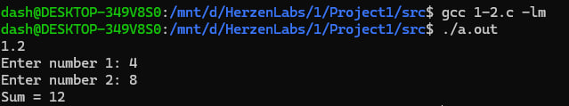
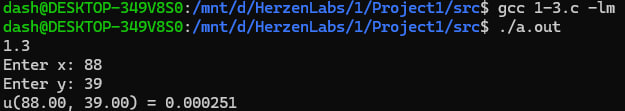
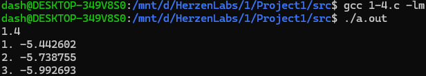
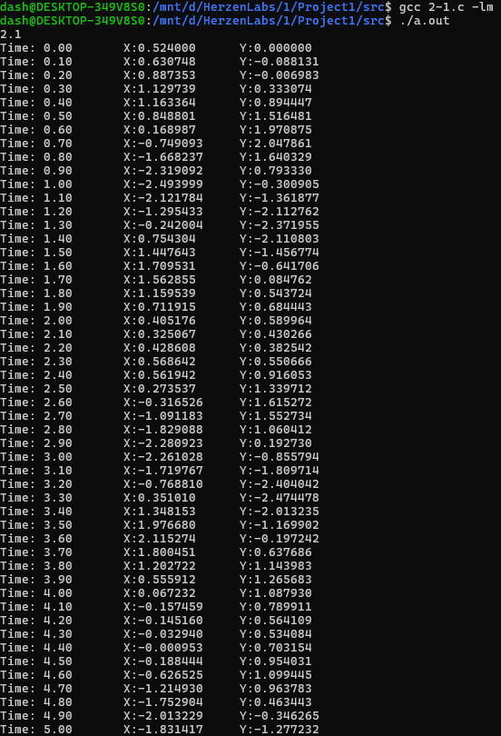
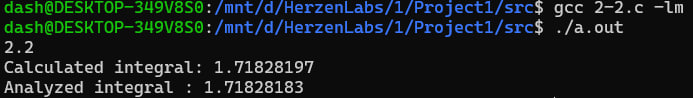
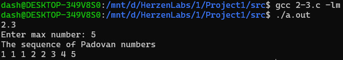

# Лабораторная работа по программированию №1  
## 1.2  
Задача: Написать простую программу. Ввести два числа с клавиатуры, вычислить их сумму и напечатать результат. Использовать функцию printf  
для приглашений на ввод и для распечатки результата. Использовать
функцию scanf для ввода каждого числа отдельно с клавиатуры. Для
получения доступа к функциям printf и scanf включить в программу заголовочный файл stdio.h. Использовать корректные спецификаторы форматирования. Здесь и далее для распечатки надписей на
экране использовать латинские буквы для избежания проблем с кодировками символов.  
Математическая модель: S = N1 + N2  
Список идентификаторов:  
| Имя  | Тип | Смысл |
| --- | --- | --- |
| num1  | int  |  первое число |
| num2  | int  |  второе число |
| sum  | int  |  сумма чисел |  

Код программы:
```C
#include <stdio.h>

int main() {
	int num1, num2, sum;

	printf("1.2 \nEnter number 1: ");
	scanf("%d", &num1);

	while (getchar() != '\n');

	printf("Enter number 2: ");
	scanf("%d", &num2);

	sum = num1 + num2;
	printf("Sum = %d\n", sum);
}
```
Результат выполненной работы:  

## 1.3  
Задача: Вычислить значение выражения, введя x и y с клавиатуры. Подберите значения аргументов x и y самостоятельно за исключением тривиальных значений. Напечатайте
вычисленное значение u(x, y) на экране. Включить в программу заголовочный файл math.h для доступа к математическим функциям.
Математическая модель:  
$$u(x, y) = \frac{1 + \sin^2 (x + y)}{2 + \left| x - \frac{2x^2}{1 + |\sin(x+y)|} \right|}$$  
Список идентификаторов:  
| Имя  | Тип | Смысл |
| --- | --- | --- |
| x  | double  |  первое число |
| y  | double  |  второе число |
| u  | double  |  вычисленное значение |  
  
Код программы:
```C
#include <stdio.h>
#include <math.h>

int main() {
	double x, y, u;
	printf("1.3 \nEnter x: ");
	scanf("%lf", &x);
	printf("Enter y: ");
	scanf("%lf", &y);

	u = (1 + pow(sin(x + y), 2)) / (2 + fabs(x - (2 * pow(x, 2)) / (1 + fabs(sin(x + y)))));

	printf("u(%.2f, %.2f) = %.6f\n", x, y, u);
}
```
Результат выполненной работы:  

## 1.4  
Задача: Вычислить значение выражения и выполнить для следующих значений:  
a = 0.12, b = 3.5, c = 2.4, x = 1.4 ;  
a = 0.12, b = 3.5, c = 2.4, x = 1.6 ;  
a = 0.27, b = 3.9, c = 2.8, x = 1.8 .  
Значения параметров и аргументов можно вводить прямо в коде программы без ввода с клавиатуры.
Математическая модель:  
$$h(x) = -\frac{x - a}{\sqrt[3]{x^2 + a^2}} - \frac{4\sqrt[4]{(x^2 + b^2)^3}}{2 + a + b + \sqrt[3]{(x - c)^2}}$$  
Список идентификаторов:  
| Имя  | Тип | Смысл |
| --- | --- | --- |
| a  | double  |  переменная для вычисления формулы |
| b  | double  |  переменная для вычисления формулы |
| c  | double  |  переменная для вычисления формулы |  
| x  | double  |  переменная для вычисления формулы |  
| term1  | double  |  первое слагаемое |  
| numerator  | double  |  числитель второго слагаемого |  
| denominator  | double  |  делитель второго слагаемого |  
| term2  | double  |  второе слагаемое |  
  
Код программы:
```C
#include <stdio.h>
#include <math.h>

double calculate_h(double x, double a, double b, double c) {
	double term1 = -(x - a) / cbrt(x * x + a * a);

	double numerator = 4 * pow(pow(x * x + b * b, 3), 0.25);
	double denominator = 2 + a + b + cbrt(pow(x - c, 2));
	double term2 = numerator / denominator;

	return term1 - term2;
}

int main() {
	printf("1.4 \n");
	double a = 0.12, b = 3.5, c = 2.4, x = 1.4;
	printf("1. %lf \n", calculate_h(x, a, b, c));
	a = 0.12, b = 3.5, c = 2.4, x = 1.6;
	printf("2. %lf \n", calculate_h(x, a, b, c));
	a = 0.27, b = 3.9, c = 2.8, x = 1.8;
	printf("3. %lf \n", calculate_h(x, a, b, c));
}
```  
Результат выполненной работы:  

## 2.1  
Задача: Вычислить используя цикл for координаты планеты Марс относительно Земли с течением времени t. Распечатать на экране координаты
для каждой итерации по t. Координаты планеты Марс для каждой
итерации задаются формулами, где r1 – радиус орбиты Марса, r2 – радиус орбиты Земли, T1 и T2 —
периоды обращения указанных планет соответственно, t – каждый
заданный момент времени внутри цикла по времени. Подберите подходящие единицы измерения для времени и расстояния.  
Математическая модель:  
$$x = r_1 \cos(\omega_1 t) - r_2 \cos(\omega_2 t) \tag{3}$$  
$$y = r_1 \sin(\omega_1 t) - r_2 \sin(\omega_2 t) \tag{4}$$  
$$\omega_1 = \frac{2\pi}{T_1} \tag{5}$$  
$$\omega_2 = \frac{2\pi}{T_2} \tag{6}$$  
Список идентификаторов:  
| Имя  | Тип | Смысл |
| --- | --- | --- |
| r1  | double  |  радиус орбиты Марса |
| r2  | double  |  радиус орбиты Земли |
| T1  | double  |  период обращения Марса |  
| T2  | double  |  период обращения Земли |  
| t_start  | double  |  начальное время |  
| t_end  | double  |  конечное время |  
| dt  | double  |  шаг |  
| x  | double  |  координата |  
| y  | double  |  координата |  
  
Код программы:
```C
#include <stdio.h>
#include <math.h>

#define PI 3.14159265358979323846

int main() {
	printf("2.1 \n");
	double r1 = 1.524; // в а.е
	double r2 = 1.0;
	double T1 = 1.881; // в годах
	double T2 = 1.0;

	const double w1 = 2 * PI / T1;
	const double w2 = 2 * PI / T2;

	const double t_start = 0.0;
	const double t_end = 5.0;
	const double dt = 0.1; // шаг

	for (double t = t_start; t <= t_end; t += dt) {
		double x = r1 * cos(w1 * t) - r2 * cos(w2 * t);
		double y = r1 * sin(w1 * t) - r2 * sin(w2 * t);
		printf("Time: %.2f\t X:%.6f\t Y:%.6f\n", t, x, y);
	}
}
```  
Результат выполненной работы:  

## 2.2  
Задача: Вычислить определённый интеграл от заданной функции методом трапеций. Функция f(x) может быть выбрана и самостоятельно. Результат интегрирования сравнить с вычисленным вручную и убедиться в корректности результата.  
Математическая модель:  
$$\int\limits_{a}^{b} f(x) \,dx = \int\limits_{a}^{b} e^{x+2} dx$$  
Список идентификаторов:  
| Имя  | Тип | Смысл |
| --- | --- | --- |
| a  | double  |  предел интегрирования |
| b  | double  |  предел интегрирования |
| n  | int  |  количество трапеций |  
| integral  | double  |  вычисленное значение |  
| exact  | double  |  значение для проверки |  
| h  | double  |  высота трапеции |  
| sum  | double  |  сумма |  
  
Код программы:  
```C
#include <stdio.h>
#include <math.h>

double f(double x) {
	return exp(x);
}
double trapezoidal_integral(double a, double b, int n) {
	double h = (b - a) / n;
	double sum = (f(a) + f(b)) / 2.0;

	for (int i = 1; i < n; i++) {
		double x = a + i * h;
		sum += f(x);
	}

	return sum * h;
}

int main() {
	printf("2.2 \n");
	double a = 0.0;
	double b = 1.0;
	int n = 1000; // количество трапеций 

	double integral = trapezoidal_integral(a, b, n);
	double exact = exp(b) - exp(a);

	printf("Calculated integral: %.8f\n", integral);
	printf("Analyzed integral : %.8f\n", exact);
}
```
Результат выполненной работы:  
  
## 2.3  
Задача: Организовать и распечатать последовательность чисел Падована, не
превосходящих число m, введенное с клавиатуры. Числа Падована
представлены следующим рядом: 1, 1, 1, 2, 2, 3, 4, 5, 7, 9,
12, 16, 21, 28, 37, 49, 65, 86, 114, 151, 200, 265, ... Использовать конструкцию for и простые варианты условной конструкции
if else. Для этих чисел заданы формулы.  
Математическая модель:  
$$\int\limits_{a}^{b} f(x) \,dx = \int\limits_{a}^{b} e^{x+2} dx$$  
Список идентификаторов:  
| Имя  | Тип | Смысл |
| --- | --- | --- |
| m  | int  |  максимальное число |
| p0  | int  |  первое число |
| p1  | int  |  второе число |  
| p2  | int  |  третье число |  
| current  | int  |  текущее число |  
  
Код программы:  
```C
#include <stdio.h>
#include <math.h>

int main() {
	printf("2.3 \n");
	int m;
	printf("Enter max number: ");
	scanf("%d", &m);
	int p0 = 1, p1 = 1, p2 = 1;
	int current;
	printf("The sequence of Padovan numbers \n");
	printf("%d ", p0);
	if (m > 1) printf("%d ", p1);
	if (m > 1) printf("%d ", p2);

	// Генерация последующих чисел
	for (int n = 3; ; n++) {
		current = p0 + p1;  // P(n) = P(n-2) + P(n-3)

		if (current > m) break;

		printf("%d ", current);

		// Обновляем предыдущие значения для следующей итерации
		p0 = p1;
		p1 = p2;
		p2 = current;
	}
}
```
  
